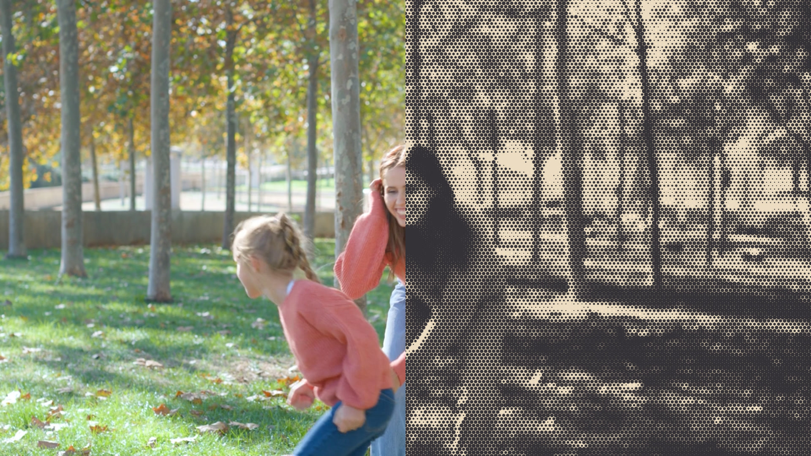

<p align="right">
  <a href="README.md">日本語</a> | English
</p>

# 🎨 Mug Advanced Halftone

<p align="left">
  <a href="https://github.com/mug-lab-3/mug-advanced-halftone/releases"></a> <a href="https://github.com/mug-lab-3/mug-advanced-halftone/blob/main/LICENSE"></a> <a href="https://github.com/mug-lab-3/mug-advanced-halftone/releases"></a> <a href="https://github.com/mug-lab-3/mug-advanced-halftone/releases/latest"></a>
</p>
<p align="center">
  
</p>

## 📝 Overview
`MugAdvancedHalftone` is a halftone generation plugin for DaVinci Resolve / Fusion.
It simulates textures such as classic halftone dots, comic book styles, pixel art, retro PC graphics, and thermal camera visuals.

### ✨ Key Features
- **Grid**: Natural halftone patterns with hexagonal (honeycomb) placement.
- **Dot Shapes**: Circle, Square, Diamond, Line, and Crosshatch.
- **Jitter**: Individual randomization for Position, Size, Aspect Ratio, and Angle.
- **Color**: Palette limitations (e.g., 16 colors) and reproduction of RGB Shift (misregistration).
- **Drawing Control**: Antialiasing, Invert Brightness, and Dot Gain adjustments.

---

## 📦 Installation

To use this effect, place the following files in the specified folders for your OS.

| File | Required | Purpose | Destination Folder |
| :--- | :---: | :--- | :--- |
| [**MugAdvancedHalftone.fuse**](https://github.com/mug-lab-3/mug-advanced-halftone/releases/latest/download/MugAdvancedHalftone.fuse) | **Required** | Plugin core (for Fusion) | `Fuses` |
| [**MugAdvancedHalftone.setting**](https://github.com/mug-lab-3/mug-advanced-halftone/releases/latest/download/MugAdvancedHalftone.setting) | **Required** | Preset for Edit Page | `Templates/Edit/Effects` |
| [**MugAdvancedHalftone.png**](https://github.com/mug-lab-3/mug-advanced-halftone/releases/latest/download/MugAdvancedHalftone.png) | Optional | Icon image | `Templates/Edit/Effects` |

### Folder Paths

#### 📂 Fuses Folder (Place `.fuse` here)

**Windows**
```text
%AppData%\Blackmagic Design\DaVinci Resolve\Support\Fusion\Fuses\
```

**macOS**
```text
~/Library/Application Support/Blackmagic Design/DaVinci Resolve/Fusion/Fuses/
```

**Linux**
```text
~/.local/share/BlackmagicDesign/DaVinciResolve/Fusion/Fuses/
```

#### 📂 Templates/Edit/Effects Folder (Place `.setting` and `.png` here)

**Windows**
```text
%AppData%\Blackmagic Design\DaVinci Resolve\Support\Fusion\Templates\Edit\Effects\
```

**macOS**
```text
~/Library/Application Support/Blackmagic Design/DaVinci Resolve/Fusion/Templates/Edit/Effects/
```

**Linux**
```text
~/.local/share/BlackmagicDesign/DaVinciResolve/Fusion/Templates/Edit/Effects/
```

---

## ⚙️ Parameters

<details>
<summary><b>Click to expand Parameter Reference</b></summary>

| Section | Parameter | Description |
| :--- | :--- | :--- |
| **Global** | Screen Density | Fineness of the dots |
| | Contrast | Adjust the contrast of the original image |
| | Invert Brightness | Inverts light and dark (Subtractive Mode) |
| | Margin X | Horizontal spacing adjustment |
| | Margin Y | Vertical spacing adjustment |
| | Screen Aspect Ratio | Aspect ratio of the screen (global pattern distortion) |
| **Dot Shape** | Dot Shape | The shape of the dots |
| | Staggered Grid | Honeycomb arrangement (Straight if Off) |
| | Line Angle | Angle of lines or halftone screens |
| | Dot Gain | Dot thickening/ink bleed |
| | Dot Size Curve | Growth curve of dot size |
| | Cutoff Dot Radius | Minimum radius to be drawn |
| | Clip Dot Radius | Maximum size limit |
| | Enable Antialias | Edge smoothing process |
| **Dot Jitter** | Jitter Noise Phase| Animation phase |
| | Position Jitter | Random positional offset |
| | Size Jitter | Random size variation |
| | Aspect Jitter | Random aspect ratio distortion |
| | Angle Jitter | Random rotation |
| **Dot Color** | Use Original Color| Use the colors from the original image for dots |
| | Color Reduction | Limit the color palette |
| | RGB Shift | Strength of misregistration/chromatic aberration |
| | Dot Color | Custom dot color setting |
| **Background** | Blend With Input | Composite directly onto the original image |
| | Paper Color | Background color (Paper color) |

</details>

---

## ⚖️ License
This project is released under the **MIT License**.
See the [LICENSE](./LICENSE) file for details.

> [!NOTE]
> **Note for Video Creators:**
> Including copyright notices or credits in your video works (rendered outputs) created using this Fuse is optional and NOT required. Feel free to use it for both commercial and non-commercial projects!

### ✅ Permissions (OK)
- **Commercial Use**: Use it freely for YouTube videos, advertisements, films, etc.
- **Modification**: You can modify the Fuse file contents for personal adjustment.
- **Redistribution**: You can introduce and distribute it on your site as long as you comply with the terms (requires copyright notice).

### ❌ Restrictions (NG)
- **No Warranty**: The author assumes no responsibility for any damage caused by using this plugin.
- **Copyright Removal**: You must not remove the author's name or license terms from the source code.

---
 
## 📜 Changelog

### v2.34 (2026/04/13)
- **Mac Support**: Resolved an issue where the effect failed to build or render correctly on Mac.
- **Internal Refactoring**: Optimized data structures and memory management within the GPU kernel to ensure stability across a wider range of hardware.
- **Improved Version Management**: Optimized internal versioning for better compatibility with ecosystem tools.

### v2.33 (2026/04/06)
- **Edge Rendering Improvements**: Fixed an issue where unnatural dots (outlining) appeared at image edges or around text on transparent backgrounds.
- **Improved Sampling Accuracy**: Enhanced internal processing to sample pixel colors more accurately, resulting in stable rendering up to the edges.

### v2.30 (2026/04/05)
- **UI Reorganization**: Moved the `AspectRatio` parameter from "Dot Shape" to "Global" and renamed it to `Screen Aspect Ratio` for a more intuitive density balance adjustment.

### v2.21 (2026/04/05)
- **Performance Optimization**: Eliminated branching in GPU kernels and replaced math operations with built-in functions for better efficiency.
- **Maintenance Improvement**: Structured kernels into logical steps and added extensive comments.
- **Stability Fixes**: Balanced vectorization to ensure compatibility with the host (Fusion).

### v2.10 (2026/04/02)
- Added Staggered Grid support for Circular and Diamond dots.

---

## 🔗 Links
- [ **YouTube: Mug Lab**](https://www.youtube.com/@MugLab3)
- [<picture><source media="(prefers-color-scheme: dark)" srcset="https://cdn.simpleicons.org/github/white"></picture> **GitHub: Mug Advanced Halftone**](https://github.com/mug-lab-3/mug-advanced-halftone)
- [<picture><source media="(prefers-color-scheme: dark)" srcset="https://cdn.simpleicons.org/x/white"></picture> **X: @MugLab3**](https://x.com/MugLab3)
